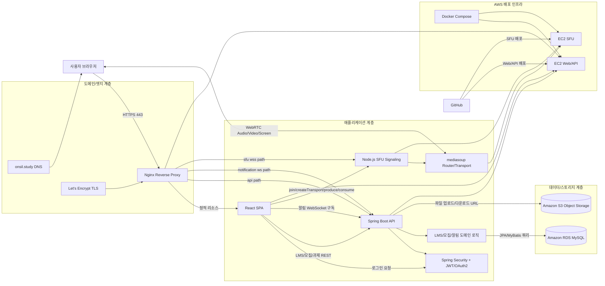

<div align="center">
  <a href="https://onsil.study">onsil.study 둘러보기</a>

  <br/><br/>

  

  # ONSIL

  스터디룸 모집, LMS 관리, WebRTC 화상수업을 통합한 학습 플랫폼

  <p>
    
    
    
    
    
    
    
    
    
    
    
    
    
  </p>
</div>

## 프로젝트 소개
`Certificate_Study`는 온라인 스터디 운영에 필요한 핵심 기능을 한 서비스에 모은 프로젝트입니다.

- 스터디 모집/참여 관리
- 과목별 LMS(공지, 출석, 과제, 게시판, 채팅)
- 실시간 화상수업(WebRTC + mediasoup SFU)
- 과제 파일 업로드 및 리소스 관리(AWS S3)

## 페이지 소개
아래 이미지는 실제 서비스 화면 캡처입니다.
로그인/메인/스터디룸/LMS/화상수업 흐름을 한 번에 확인할 수 있습니다.

### 1.

로그인 전 메인 페이지입니다. 서비스 소개, 주요 기능, 진입 동선을 한 화면에서 확인할 수 있습니다.

### 2.

OAuth2 로그인 선택 페이지입니다. 소셜 계정 기반으로 빠르게 인증하고 서비스에 접근할 수 있습니다.

### 3.

일반 로그인 페이지입니다. 이메일/비밀번호 인증으로 기존 계정 사용자가 바로 로그인할 수 있습니다.

### 4.

일반 회원가입 페이지입니다. 신규 사용자 정보 입력과 계정 생성 절차를 제공합니다.

### 5.

로그인 후 메인 페이지입니다. 사용자 맞춤 상태에서 스터디 탐색, 클래스룸 이동, 알림 확인이 가능합니다.

### 6.

스터디 모집 페이지입니다. 개설된 스터디 목록을 확인하고 조건에 맞는 스터디를 찾아 신청할 수 있습니다.

### 7.

스터디 그룹 만들기 페이지입니다. 스터디명, 카테고리, 모집 조건 등 기본 정보를 설정합니다.

### 8.

스터디 그룹 만들기 페이지(상동)입니다. 생성 폼의 추가 옵션과 상세 입력 항목을 확인할 수 있습니다.

### 9.

가입한 클래스룸 확인 페이지입니다. 내가 참여 중인 클래스룸 목록과 진입 상태를 한눈에 볼 수 있습니다.

### 10.

스터디 모집 페이지 내 마이페이지 화면입니다. 내 신청 내역, 활동 정보, 개인 설정 동선을 제공합니다.

### 11.

클래스룸 진입 후 첫 LMS 화면입니다. 과목 대시보드 성격으로 출석, 과제, 게시판, 일정 메뉴로 이동합니다.

### 12.

내 출석조회 페이지입니다. 개인 출석 이력과 상태를 날짜 기준으로 확인할 수 있습니다.

### 13.

전체 출석조회 페이지입니다. 스터디원 전체 출석 현황을 집계 형태로 확인할 수 있습니다.

### 14.

과제목록 페이지입니다. 등록된 과제를 목록으로 조회하고 제출/상세 이동을 수행할 수 있습니다.

### 15.

과제생성 모달입니다. 제목, 설명, 마감일, 첨부자료 등 과제 생성에 필요한 항목을 입력합니다.

### 16.

게시판 목록 페이지입니다. 공지/일반 글 목록을 확인하고 게시글 작성 또는 상세로 이동할 수 있습니다.

### 17.

게시판 상세 페이지입니다. 본문, 댓글, 첨부파일 등 게시글 단위의 상세 상호작용을 제공합니다.

### 18.

AI 기반 예상문제/요약노트 페이지입니다. 학습 자료를 바탕으로 문제 생성과 핵심 요약을 지원합니다.

### 19.

일정관리 페이지입니다. 학습 일정과 중요한 날짜를 캘린더 형태로 확인하고 관리할 수 있습니다.

### 20.

일정추가 모달(방장 전용)입니다. 일정 제목, 시간, 메모를 등록해 공용 캘린더에 반영합니다.

### 21.

스터디원 관리 페이지(방장 전용)입니다. 구성원 상태 확인, 역할 관리, 운영 관련 액션을 수행합니다.

### 22.

LMS 마이페이지입니다. 과목 단위 개인 정보와 학습 활동 내역을 관리할 수 있습니다.

### 23.

화상수업의 얼굴 아바타 및 배경 제거 기능 화면입니다. 카메라 입력을 실시간으로 가공해 표시합니다.

### 26.

화상채팅방 화면공유 기능입니다. 참가자가 자신의 화면을 공유해 발표/협업을 진행할 수 있습니다.

## 아키텍처 구조
### 시스템 아키텍처(상세)


### 아키텍처 설명
- 사용자는 `onsil.study` 도메인으로 접속하고, TLS는 `Let's Encrypt` + `Nginx`에서 처리합니다.
- `Nginx`는 `정적 파일(React)`, `REST API(/api/*)`, `알림 WS`, `SFU WSS(/sfu)`를 경로 기반으로 분기합니다.
- 프론트엔드(React)는 로그인/권한 검증 후 LMS, 스터디 모집, 과제, 게시판 기능을 REST로 호출합니다.
- 인증/인가는 `Spring Security + JWT/OAuth2`로 처리하며 사용자 세션 상태를 보호합니다.
- 도메인 로직은 `Spring Boot` 내부 서비스 계층에서 수행되고, 데이터는 `JPA + MyBatis`로 조회/저장합니다.
- 정형 데이터는 `Amazon RDS(MySQL)`, 파일 데이터는 `Amazon S3`에 저장합니다.
- 화상수업은 `Node.js SFU Signaling`이 세션 제어를, `mediasoup`가 실제 미디어 라우팅을 담당합니다.
- 브라우저는 SFU에 `join/createTransport/produce/consume` 시그널링을 보내고, 오디오/비디오/화면공유는 WebRTC로 송수신합니다.
- Web/API와 SFU는 각각 `EC2`에 배포되며, 실행 오케스트레이션은 `Docker Compose`를 사용합니다.
- 코드 변경은 `GitHub` 기준으로 Web/API 서버와 SFU 서버에 분리 배포됩니다.

### 디렉터리 구조
```text
Certificate_Study/
├─ Frontend/                # React 클라이언트
│  └─ src/
│     ├─ auth/              # 로그인/회원가입/OAuth
│     ├─ room/              # 스터디룸 메인/생성/마이페이지
│     ├─ lms/               # LMS 화면(출석/과제/게시판/채팅)
│     └─ webrtc/            # 화상수업 Meeting 페이지
├─ Backend/                 # Spring Boot API
│  ├─ src/main/java/com/example/demo/
│  │  ├─ security/ jwt/ oauth/
│  │  ├─ room*/ attendance/ assignment/ board/ chat/
│  │  └─ s3/ notification/
│  └─ src/main/resources/mapper/
│     └─ *Mapper.xml        # MyBatis SQL 매퍼
├─ SFU/                     # mediasoup 시그널링 서버
│  └─ sfu_server.js
├─ docker-compose-web.yaml
└─ docker-compose-sfu.yaml
```

## 기술 스택
### Frontend
- `React`
- `React Router`
- `Axios`
- `STOMP/SockJS`

### Backend
- `Spring Boot`
- `Spring Security`
- `JWT`
- `Spring Data JPA`
- `MyBatis`
- `Gradle`

### SFU 서버
- `Node.js`
- `mediasoup`
- `WebSocket`

### DB
- `Amazon RDS`
- `MySQL`

### 클라우드 인프라
- `Nginx`
- `Docker`
- `Amazon EC2`
- `Amazon S3`
- `Let's Encrypt`

## 테스트 방법
아래 계정으로 배포된 서비스에 바로 접속해 주요 기능을 테스트할 수 있습니다.

1. `https://onsil.study` 접속
2. 이메일: `test@test.com`
3. 비밀번호: `1234`
4. 로그인 후 스터디룸, LMS, 화상수업 기능 테스트


